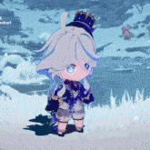

<p align="center">
	
</p>

```zsh
Toheartz@cachy-os: ~/my_readme $ fastfetch
```


```text
--------------------------˚₊‧꒰ა ☆ ໒꒱ ‧₊˚---------------------------

Username  : ToHeartz
WhoamI    : Vocational high school student trying to become a coder
OS        : CachyOS, Arch Linux, Windows (Adobe stuff)
Desktop   : KDE, Hyprland
Hobbies   : Photography, vibe coding, coffee, ricing
Games     : House Flipper, Roblox, Genshin Impact (hiatus)
Interests : AI, Linux, coffee, and a sense of life

╰────────────────️ nothing special in here twin ️───────────────────╯

-------------------------------------------------------------------
```

<p align="center">
	
</p>

<br clear="both" />

## Welcome to my profile

I am a vocational high school student who wants to become a professional coder, but currently spends more time configuring things than writing them. 

Coffee-powered · Linux user · Photography enjoyer · Casual gamer

> This account is only thing that i can actually flex it to my friend (even though it's useless lmao)

## About me

```text
Username  : ToHeartz
Education : Vocational high school student
OS        : CachyOS, Arch Linux, Windows (Adobe stuff)
Desktop   : KDE, Hyprland
Hobbies   : Photography, vibe coding, coffee, ricing
Games     : House Flipper, Roblox, Genshin Impact (hiatus)
Interests : AI, Linux, coffee, and a sense of life
```

<table width="100%">
	<tr>
		<td width="50%" valign="top">
			<h2 align="center">Experience</h2>
			<ul>
				<li>Learning Linux, Bash, and web development one configuration at a time.</li>
				<li>Making my desktop feel like mine through ricing and small quality-of-life tweaks.</li>
				<li>Exploring AI, creative tools, and the strange art of making code behave.</li>
			</ul>
            <br>
			<p align="center">
				<a href="https://github.com/Abiyyu-202">
					
				</a>
			</p>
			<p align="center"><small>Every little slice is part of the performance.</small></p>
		</td>
		<td width="50%" align="center" valign="top">
			<h2>Daily inspo</h2>
            <br>
			
			<br><br>
			
		</td>
	</tr>
</table>

## Commit stats & activity

<p align="center">
	<a href="https://github.com/Abiyyu-202">
		
	</a>
	<a href="https://github.com/Abiyyu-202">
		
	</a>
</p>

<!--START_SECTION:waka-->
## Coding time

This section is updated automatically by WakaTime.

<!--END_SECTION:waka-->

## Cutie counter

<table width="100%">
	<tr>
		<td valign="middle">
			<strong>People who visit my profile :3</strong><br><br>
			Hehe~ another cutie has been caught.<br><br>
			<small>Thanks for stopping by. Stay hydrated and make something cute.</small>
		</td>
		<td align="right" valign="middle" width="55%">
			<a href="https://github.com/Abiyyu-202">
				
			</a>
		</td>
	</tr>
</table>

## Contact me

Feel free to reach out. If I forget to reply, poke me again ૮ ˶ᵔ ᵕ ᵔ˶ ა

<p align="center">
	<a href="https://www.linkedin.com/in/ahmad-taher-al-abiyyu-3a8b9129"></a>
	<a href="https://www.instagram.com/taher_abiyyu/"></a>
	<a href="https://github.com/Abiyyu-202"></a>
	<a href="https://discord.com/"></a>
</p>
